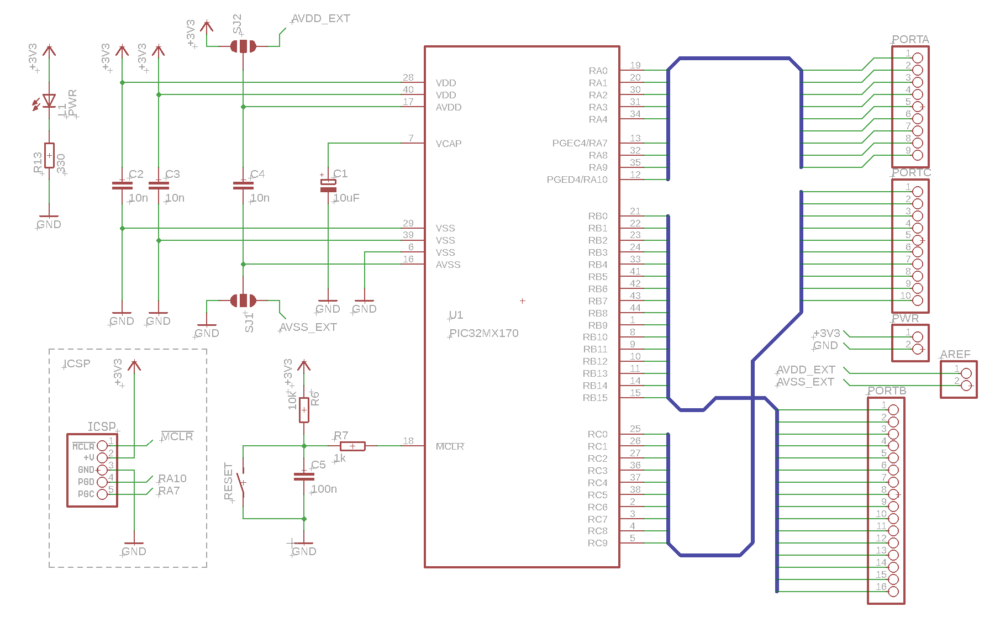

Breakout for PIC32MX170 in 44pin TQFP package
=============================

This is a simple "inline" breakout for using the 44pin TQFP package in a breadboard.
The board contains the bare minimum support passives to get the PIC running.

